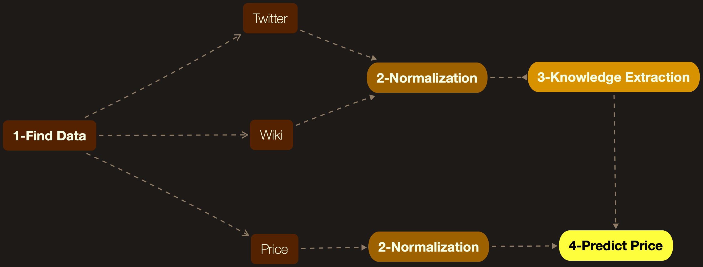

# Price Prediction Based on News, Twitter and Wikipedia

Prediction Based on News, Twitter and Wikipedia for;
* Stock Price (SBUX, etc.)
* Index (S&P 500 etc.)
* Product(XAUUSD etc.)
* Exchange Rate (USDCAD etc.)

**Warning**: Tests were done only for the crude oil price.

## Overview


This application trying to predict the price of oil or stock with following steps;
1. [Information Gathering (News, Stock Price, Tweets etc.)](#1-information-gathering)
    1. [Find News](#11-find-news)
    2. [Find Stock Price](#12-find-stock-price)
    3. [Find Tweets](#13-find-tweets)
    4. [Find Wikipedia Information](#14-find-wikipedia-information)
2. [Data Normalization](#2-data-normalization)
3. [Knowledge Extraction from Wikipedia and Twitter](#3-knowledge-extraction-from-wikipedia-and-twitter)
    1. [Vector Similarity Calculation](#31-vector-similarity-calculation)
        1. [Wikipedia](#311-wikipedia)
        2. [Twitter](#312-twitter)
4. [Predict Price Using DNN](#4-predict-price-using-dnn)

* [Other general informations can be found in here](docs/General.md)

### 1. Information Gathering 

Information gathering has three phase;

1. [Find News](#11-find-news)
2. [Find Stock Price](#12-find-stock-price)
3. [Find Tweets](#13-find-tweets)
4. [Find Wikipedia Information](#14-find-wikipedia-information)

#### 1.1. Find News

Finding news very challenging job. Most of the news agencies does not store/serve their older news. Reliable sources like Reuters and Bloomberg are charge you money to access their resources. 

Our solution was using [Wayback Machine](archive.org);
* Problems:
    * Using Wayback Machine could be very costly in terms of time. 
        * You have to crawl all the links and sub-links to news page. 
    * Most of the time home pages are well preserved but news pages are not crawled.
* Solution:
    * We were mainly relay on RSS feeds(30-50 News in feeds).
    * Scan recorded RSS feeds in Wayback Machine.
        * Crawl the original news page
        * If original site is down
            * Search link Wayback Machine
                * Crawl site in Wayback Machine
* We were able to crawl about 500.000 news.
    * You can access the data details in the link.
    
* Code Location : `Archive/News/Collector`
            
#### 1.2. Find Stock Price

Most of the providers are charge you money to access their resources. [FRD](https://firstratedata.com) provides stock and exchange data for free.

* FRD provide data in CVC format. 
    * Parse, Unify the format (Date etc.) and load to DB.  

* Code Location : `Archive/Market`

#### 1.3. Find Tweets

Using Python library like Tweepy could be very time consuming. We use pre-fetched data in Wayback Machine.

* Download Wayback Machine archives.
* Unpack and Load To DB
    * We only load specific fields. This is dramatically reduce db size.
* More than 1 billion tweets are collected. 

* Code Location : `Archive/Twitter`

#### 1.4. Find Wikipedia Information

Search home page of products or companies and record the basic data such as title summary and content.   

* Code Location : `Archive/Wiki`

### 2. Data Normalization

For better results DNN needs unified inputs.

* Database merges are made for each resource(Tweets, Stock Price, Wiki etc.).
    * Strings inputs are pre-processed.
        * This is done for computational resource saving.
    * Code Location : `Archive/Organizer`
* Integer inputs are normalized using db scripts.
    * Code Location : `Scripts/Database/Mongo`
    
### 3. Knowledge Extraction from Wikipedia and Twitter

Wikipedia and Twitter is used to obtain more accurate results.

#### 3.1 Vector Similarity Calculation

* Glove and Google's Word2Vec are used for vectorization.

* Cosine Similarity (CS)
    * 
* Word Mover's Distance (WMD)
    * 
    * For mode detail go to [link](https://markroxor.github.io/gensim/static/notebooks/WMD_tutorial.html) 
* **CS** and **WMD** has been tested. There was no major effect on results.   


#### 3.1.1 Wikipedia

Wikipedia is used to understand how **related** news to the asset to be estimated.


* News and assets wikipedia summaries used for vector similarity calculation. 

#### 3.1.2 Twitter 

 

1. Twitter is used to understand **impact** of the news. 
2. Tweets between release of news and last 5 days are analysed for calculating impact factor.
    1. Tweets are filtered based on hashtags that are contains (5 Days is selected because complexity); 
        1. News Title Words
        2. Pre-Defined Words (News, Latest etc.) 
3. Vector similarity is calculated between tweet and news title
4. If similarity is larger than predefined value(70%) tweet considered as has impact (+1).
    * If tweet user has approved account its impact factor is doubled (+2).
    
Impact of News :  (# of Tweets in Last 5 Days/Total Impact) 

### 4. Predict Price Using DNN

There are 4 different models. Each model has its own configuration(config.json). This is for finding optimal settings.

* News based models;
    * **NewsDnnGeneralMain**
        
        * LSTM based model
        * DNN Input : (Word Vector + Twitter + Wiki)
        * Code : `Predictor/NewsDnnGeneral`  
    * **NewsCnnMain**
        
        * Convolution layer based model
        * DNN Input : (Word Vector + Twitter + Wiki)
        * Code : `Predictor/NewsCnn`  
    * **NewsCateMain**
        
        * BERT based model
        * DNN Input : Word Vector
        * Code : `Predictor/NewsCategorization`
        
    * For all news models, multiple Twitter and Wiki length are tested.

* Price based models;
    * Price RNN
        * LSTM based model

## Results 

### News Statistics

* We used 2014-2016 interval since it has largest set. You can see detail of data in below;

|                  | 2014   | 2015   | 2016   | Total   |
|------------------|--------|--------|--------|---------|
| Bussines Related | 32,345 | 17,005 | 31,185 | 80,535  |
| Unknown          | 42,683 | 23,885 | 44,459 | 111,027 |
| Ratio            | -24%   | -29%   | -30%   | -28%    |
| Total            | 75,028 | 40,890 | 75,644 | 191,562 |
| Avg Mnt          | 6,252  | 3,408  | 6,304  | -       |
| Avg Day          | 208    | 114    | 210    | -       |
| Avg Hour         | 9      | 5      | 9      | -       |

* Business related info decided based on news agency category.
    * Bussines Related (Category) : business, politics, economy, money
    * Unknown (Category) : world, news, tech

### Results

#### Categorization
* BERT was also used to categorization of news. This was only used for detecting Oil related news. 
* We hand pick 2525 news from our database which is used to train BERT. I achieved **93%** success in the test. You can find details of training in below;

| HandPick | Train | Validate  | Test | Total  |
|----------|-------|-----------|------|--------|
| Positif  | 123   | 3         | 21   | 147    |
| Negatif  | 1827  | 41        | 486  | 2378   |
| Total    | 1950  | 44        | 507  | 2525   |

* After Training, In all of our database BERT recognized **2546** oil related news. You can find detailed results in below;

|          | All News | 2014-2017 |
|----------|----------|-----------|
| Positif  | 2.548    | 864       |
| Negatif  | 562.253  | 190.698   |

* BERT categorized (2014-2017) are feed to NewsDnnGeneralMain 

| Accuracy | Mean Test Loss | Accuracy Score | F1      | Hamming | Jaccard | Precision | Recall | Epoch | With         |
|----------|----------------|----------------|---------|---------|---------|-----------|--------|-------|--------------|
| 0.428    | 0.731679       | 0.45           | 0.27931 | 0.55    | 0       | 0.2025    | 0.45   | 10    | Tweet & Wiki |
| 0.428    | 0.715534       | 0.45           | 0.27931 | 0.55    | 0       | 0.2025    | 0.45   | 15    | -            |


* BERT categorized are feed to Bert (Train Size : 1215)

| Accuracy | F1       | Hamming  | Jaccard | Precision | Recall   | Epoch |
|----------|----------|----------|---------|-----------|----------|-------|
| 0.429    | 0.640884 | 0.528455 | 0       | 1         | 0.471545 | 6     |


Example results:
```
* "Energy giant BP is delaying critical tests on a new cap which is supposed to stop the oil from pouring out of a damaged well in the Gulf of Mexico."
* "A key test to see if the Gulf of Mexico oil spill can be stopped was delayed to allow experts more time to review its safety and effectiveness."
```

#### Test Results

* Key Info (Agency Category)
    * Bussines(P) : 'Business', 'Economics', 'Money', 'Economy', 'Politics'
    * Bussines(W) : 'Business', 'Economics', 'Money', 'Economy', 'World'
    * Bussines(E) : 'Business', 'Economics', 'World'
    * All : All Tags

##### 1. NewsDnnGeneralMain
* This is our first network results. 
    * **Cosine Similarity** is used for Wiki and Twitter.
    * There are no replicated result in network input. Ex: [Text(100) + Wiki(1) + Twitter(1)]

| #  | Test            | Accuracy     | Mean Test Loss | Database                       | Key                                                             | Batch Size | Sequence Length | Input Size | Hidden | Number of Layers | Dropout Prob | Learning Rate | Test Size | Train Size | Validation Size | Stock                 | Info                                                 |
|----|-----------------|--------------|----------------|--------------------------------|-----------------------------------------------------------------|------------|-----------------|------------|--------|------------------|--------------|---------------|-----------|------------|-----------------|-----------------------|------------------------------------------------------|
| 1  | 24102019-231340 | 0.4903262163 | 0.73420977     | FilteredNewsForDnn             | Bussines(E)                     | 10         | 200             | 100        | 2      | 2                | 0.2          | 0.001         |           |            |                 | Starbucks Corporation |                                                      |
| 2  | 25102019-073205 | 0.4873142626 | 0.730376       | FilteredNewsForDnn             | Bussines(W) | 10         | 200             | 100        | 2      | 2                | 0.2          | 0.005         |           |            |                 | Starbucks Corporation |                                                      |
| 3  | 25102019-175105 | 0.4890572527 | 0.738844       | FilteredNewsForDnn             | All                                                             | 10         | 200             | 100        | 2      | 2                | 0.2          | 0.001         |           |            |                 | Starbucks Corporation |                                                      |
| 4  | 31102019-150925 | 0.4888950178 | 0.728865       | FilteredNewsForDnn             | All                                                             | 20         | 200             | 100        | 2      | 2                | 0.2          | 0.005         | 61639     | 133848     | 7255            | Starbucks Corporation |                                                      |
| 5  | 31102019-204219 | 0.4879216081 | 0.727302       | FilteredNewsForDnn             | All                                                             | 100        | 200             | 100        | 2      | 2                | 0.2          | 0.005         | 61639     | 133848     | 7255            | Starbucks Corporation |                                                      |
| 6  | 01112019-055327 | 0.5016791317 | 0.738031159    | FilteredNewsWikiForDnn         | All                                                             | 20         | 200             | 101        | 2      | 2                | 0.2          | 0.005         | 61639     | 133848     | 7255            | Brent Crude           | Wiki Percentage Added                                |
| 7  | 01112019-160058 | 0.2780220315 | 0.7339391309   | FilteredNewsWikiForDnn         | All                                                             | 20         | 200             | 101        | 2      | 2                | 0.2          | 0.005         | 61639     | 133848     | 7255            | Brent Crude           | Wiki Percentage Added - Less than 50 percent removed |
| 8  | 06112019-125944 | 0.5016791317 | 0.7380401356   | FilteredNewsWikiForDnn         | All                                                             | 20         | 200             | 100        | 2      | 2                | 0.2          | 0.005         | 61639     | 133848     | 7255            | Brent Crude           | Only News                                            |
| 9  | 06112019-152011 | 0.5212271303 | 0.725981371    | FilteredNewsWikiForDnn         | Bussines(W) | 20         | 200             | 100        | 2      | 2                | 0.2          | 0.005         | 19786     | 54697      | 2687            | Brent Crude           | Filtered News                                        |
| 10 | 06112019-191923 | 0.5210755079 | 0.726327       | FilteredNewsWikiForDnn         | Bussines(W) | 20         | 200             | 101        | 2      | 2                | 0.2          | 0.005         | 19786     | 54697      | 2687            | Brent Crude           | Wiki Percentage Added                                |
| 11 | 09112019-142055 | 0.5016791317 | 0.738033       | FilteredNewsWikiAndTweetForDnn | All                                                             | 20         | 200             | 102        | 2      | 2                | 0.2          | 0.005         | 61639     | 125771     | 7255            | Brent Crude           | Wiki Percentage / Twitter Added                      |
| 12 | 09112019-184826 | 0.5257654499 | 0.725818       | FilteredNewsWikiAndTweetForDnn | Bussines(E)                     | 20         | 200             | 102        | 2      | 2                | 0.2          | 0.005         | 15971     | 38703      | 2096            | Brent Crude           | Wiki Percentage / Twitter Added                      |
| 13 | 10112019-060853 | 0.5016791317 | 0.738031       | FilteredNewsWikiAndTweetForDnn | All                                                             | 20         | 200             | 101        | 2      | 2                | 0.2          | 0.005         | 61639     | 125771     | 7255            | Brent Crude           | Only Twitter Added                                   |


##### 2. NewsDnnGeneralMain

* This is our improved network results (More dinamic).
    * **Word Mover's Distance (WMD)** is used for Wiki and Twitter.
    * Twitter and Wiki inputs are dynamic. Ex: [Text(100) + Wiki(50) + Twitter(50)]
    * 7. Test result shows that filtering baced on Wiki percentage(Relatedness of News) result in less accuracy.
        * Wiki should not be used ? - Revisit wiki percentage extraction.

| #  | Test            | Accuracy     | Mean Test Loss | Database                   | Key                                                                | Batch Size | Sequence Length | Input Size | Hidden | Number of Layers | Dropout Prob | Learning Rate | Test Size | Train Size | Validation Size | Price Buffer Percent       | Info                                                   |
|----|-----------------|--------------|----------------|----------------------------|--------------------------------------------------------------------|------------|-----------------|------------|--------|------------------|--------------|---------------|-----------|------------|-----------------|-------------|--------------------------------------------------------|
| 1  | 16122019-092015 | 0.5011275329 | 0.761404       | FilteredNewsGeneral        | All                                                                | 20         | 200             | 125        | 1      | 2                | 0.2          | 0.005         | 61639     | 116874     | 7255            | - | Wiki * 25 - Glove 100                                  |
| 2  | 16122019-140720 | 0.5011275329 | 0.761388       | FilteredNewsGeneral        | All                                                                | 20         | 200             | 150        | 1      | 2                | 0.2          | 0.005         | 61639     | 116874     | 7255            | - | Wiki * 50 - Glove 100                                  |
| 3  | 17122019-020753 | 0.5011275329 | 0.761395       | FilteredNewsGeneral        | All                                                                | 20         | 200             | 350        | 2      | 2                | 0.2          | 0.005         | 61639     | 116874     | 7255            | - | Wiki * 50 - w2v300                                     |
| 4  | 23122019-034552 | 0.5013145266 | 0.76148218     | FilteredNewsGeneralNoTagES | Bussines(P) | 30         | 200             | 400        | 57     | 2                | 0,2          | 0.005         | 46947     | 2687       | 23963           | 0.005       | Wiki * 50 - Tweet 50 - w2v300                          |
| 5  | 23122019-042555 | 0.5013145266 | 0.76128497     | FilteredNewsGeneralNoTagES | Bussines(P) | 30         | 200             | 450        | 51     | 2                | 0,2          | 0.005         | 46947     | 2687       | 23963           | 0.005       | Wiki * 75 - Tweet 75 - w2v300                          |
| 6  | 23122019-051338 | 0.5001043275 | 0.761840785    | FilteredNewsGeneralNoTagES | Bussines(P) | 30         | 200             | 400        | 100    | 2                | 0.2          | 0.005         | 46947     | 2687       | 23963           | 0.005       | Wiki * 50 - Tweet 50 - w2v300                          |
| 7  | 23122019-055407 | 0.5013145266 | 0.761498145    | FilteredNewsGeneralNoTagES | Bussines(P) | 30         | 200             | 400        | 57     | 2                | 0.2          | 0.005         | 46947     | 2687       | 23963           | 0.005       | Wiki * 50 - Tweet 50 - w2v300 - Tweet Normilized Count |
| 8  | 23122019-064208 | 0.5013145266 | 0.762820776    | FilteredNewsGeneralNoTagES | Bussines(P) | 30         | 200             | 400        | 100    | 2                | 0.2          | 0.005         | 46947     | 2687       | 23963           | 0.005       | Wiki * 50 - Tweet 50 - w2v300 - Tweet Normilized Count |
| 9  | 23122019-083438 | 0.5011521111 | 0.771138144    | FilteredNewsGeneralNoTagES | All                                                                | 30         | 200             | 400        | 57     | 2                | 0.2          | 0.005         | 116852    | 7254       | 61626           | 0.005       | Wiki * 50 - Tweet 50 - w2v300 - Tweet Normilized Count |
| 10 | 23122019-091919 | 0.4909652381 | 0.811634951    | FilteredNewsGeneralNoTagES | Bussines(P) | 30         | 200             | 400        | 57     | 2                | 0.2          | 0.005         | 46947     | 2687       | 23963           | 0.010       | Wiki * 50 - Tweet 50 - w2v300 - Tweet Normilized Count |
| 11 | 23122019-095959 | 0.4415974628 | 1.002935975    | FilteredNewsGeneralNoTagES | Bussines(P) | 30         | 200             | 400        | 57     | 2                | 0.2          | 0.005         | 46947     | 2687       | 23963           | 0.050       | Wiki * 50 - Tweet 50 - w2v300 - Tweet Normilized Count |


##### 3. NewsCnnMain
* There was no significant improvement in results.

##### 4. BERT
* There was no significant improvement in results. Accuracy is between 0.55 and 0.49.

## Database 
* Mongo DB
	* Mac OS
		* Install MongoDB `brew install mongodb-community@4.0` 
		* Start the Mongo daemon `brew services start mongodb`
		* Stop the Mongo daemon `brew services stop mongodb`
	* Windows
		* [Download the installer (.msi) ](https://www.mongodb.com/download-center/community?jmp=docs)
		* Double-click the .msi file.
		* [Install MongoDB Compass](https://www.mongodb.com/products/compass)
		* Run the Mongo daemon `"C:\Program Files\MongoDB\Server\4.0\bin\mongo.exe"`
			* As a Service Start `net start MongoDB`
			* As a Service Stop `net stop MongoDB`
			
## Data
* Resources
    * [OECD](https://data.oecd.org)
    * [Stock Price - FRD](https://firstratedata.com)
    * [News - IA](https://archive.org/)
    * [Twitter - IA](https://archive.org/details/twitterstream)
        * [IA Twitter Query](https://archive.org/search.php?query=Twitter+stream+data&and%5B%5D=collection%3A%22twitterarchive%22&and%5B%5D=collection%3A%22archiveteam%22&and%5B%5D=collection%3A%22arxiv%22) 
    * [Wikipedia](https://www.wikipedia.org/)
    * Pre-Trained Vectors
        * GoogleNews Vectors (word2vec)
        * [GloVe](https://nlp.stanford.edu/projects/glove/)
			
## Requirements

### Software
* Package Manager: `Conda 4.6.11`
    * Environment Name : `MScThesis`
* Programming Language : `Python 3.6`
* Database : `MongoDB 4.x`
* IDEA (Recommended) : `IntelliJ - PyCharm`

### Package List
* Package list can accessed from MScThesis.yml
    * Create env. and install packages `conda env create -f MScThesis.yml`
    * Activate Env. `conda activate MScThesis`
    * Remove Env. `conda remove --name MScThesis --all`
* For More Information
    * pymongo
        * MongoDB Access
    * mongolog 
        * Centralized Logging 
    * keras
    * feedparser
    * configparser
    * gensim
        * Word2Vec
    * newspaper3k
        *  Info 
            * Use [NLTK - Natural Language Toolkit](https://www.nltk.org/data.html)
            * Download Corpora ` curl https://raw.githubusercontent.com/codelucas/newspaper/master/download_corpora.py | python3`
            * Corpora List
                * brown - Required for FastNPExtractor
                * punkt - Required for WordTokenizer
                * maxent_treebank_pos_tagger - Required for NLTKTagger
                * movie_reviews - Required for NaiveBayesAnalyzer
                * wordnet - Required for lemmatization and Wordnet
                * stopwords
        * `brew install libxml2 libxslt`
        * `brew install libtiff libjpeg webp little-cms2`
        * `pip3 install newspaper3k` 
            * `conda install -c conda-forge newspaper3k`
            * `import nltk; nltk.download()`
     * `pip install transformers`

## Test Environment

* Test Dependency
    * Run `mnist_cnn.py`

### Helpers

1. MongoDB 
    * Python Examples : `https://github.com/janbodnar/pymongo-examples`
    * 
2. 