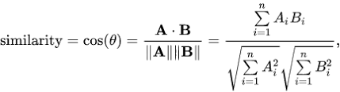
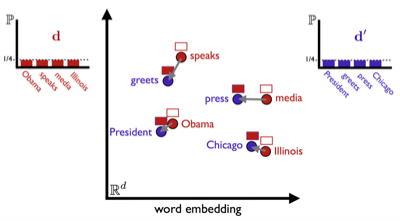

# Price Prediction Based on News, Twitter and Wikipedia

Prediction Based on News, Twitter and Wikipedia for;
* Stock Price (SBUX, etc.)
* Index (S&P 500 etc.)
* Product(XAUUSD etc.)
* Exchange Rate (USDCAD etc.)

**Warning**: Tests were done only for the crude oil price.

## Overview

This application trying to predict the price of oil or stock with following steps;
1. [Information Gathering (News, Stock Price, Tweets etc.)](#1-information-gathering)
2. [Data Normalization](#2-data-normalization)
3. [Knowledge Extraction from Wikipedia and Twitter](#3-knowledge-extraction-from-wikipedia-and-twitter)
4. [Predict Price Using DNN](#4-predict-price-using-dnn)

### 1. Information Gathering 

Information gathering has three phase;

1. [Find News](#1-find-news)
2. [Find Stock Price](#2-find-stock-price)
3. [Find Tweets](#3-find-tweets)
4. [Find Wikipedia Information](#4-find-wikipedia-information)

#### 1.1. Find News

Finding news very challenging job. Most of the news agencies does not store/serve their older news. Reliable sources like Reuters and Bloomberg are charge you money to access their resources. 

Our solution was using [Wayback Machine](archive.org);
* Problems:
    * Using Wayback Machine could be very costly in terms of time. 
        * You have to crawl all the links and sub-links to news page. 
    * Most of the time home pages are well preserved but news pages are not crawled.
* Solution:
    * We were mainly relay on RSS feeds(30-50 News in feeds).
    * Scan recorded RSS feeds in Wayback Machine.
        * Crawl the original news page
        * If original site is down
            * Search link Wayback Machine
                * Crawl site in Wayback Machine
* We were able to crawl about 500.000 news.
    * You can access the data details in the link.
    
* Code Location : `Archive/News/Collector`
            
#### 1.2. Find Stock Price

Most of the providers are charge you money to access their resources. [FRD](https://firstratedata.com) provides stock and exchange data for free.

* FRD provide data in CVC format. 
    * Parse, Unify the format (Date etc.) and load to DB.  

* Code Location : `Archive/Market`

#### 1.3. Find Tweets

Using Python library like Tweepy could be very time consuming. We use pre-fetched data in Wayback Machine.

* Download Wayback Machine archives.
* Unpack and Load To DB
    * We only load specific fields. This is dramatically reduce db size.
* More than 1 billion tweets are collected. 

* Code Location : `Archive/Twitter`

#### 1.4. Find Wikipedia Information

Search home page of products or companies and record the basic data such as title summary and content.   

* Code Location : `Archive/Wiki`

### 2. Data Normalization

For better results DNN needs unified inputs.

* Database merges are made for each resource(Tweets, Stock Price, Wiki etc.).
    * Strings inputs are pre-processed.
        * This is done for computational resource saving.
    * Code Location : `Archive/Organizer`
* Integer inputs are normalized using db scripts.
    * Code Location : `Scripts/Database/Mongo`
    
### 3. Knowledge Extraction from Wikipedia and Twitter

Wikipedia and Twitter is used to obtain more accurate results.

#### 3.1 Vector Similarity Calculation

* Glove and Google's Word2Vec are used for vectorization.

* Cosine Similarity (CS)
    * 
* Word Mover's Distance (WMD)
    * 
    * For mode detail go to [link](https://markroxor.github.io/gensim/static/notebooks/WMD_tutorial.html) 
* **CS** and **WMD** has been tested. There was no major effect on results.   

#### 3.1.2 Wikipedia

Wikipedia is used to understand how **related** news to the asset to be estimated.

* News and assets wikipedia summaries used for vector similarity calculation. 

#### 3.1.3 Twitter 

 

1. Twitter is used to understand **impact** of the news. 
2. Tweets between release of news and last 5 days are analysed for calculating impact factor.
    1. Tweets are filtered based on hashtags that are contains (5 Days is selected because complexity); 
        1. News Title Words
        2. Pre-Defined Words (News, Latest etc.) 
3. Vector similarity is calculated between tweet and news title
4. If similarity is larger than predefined value(70%) tweet considered as has impact (+1).
    * If tweet user has approved account its impact factor is doubled (+2).
    
Impact of News :  (# of Tweets in Last 5 Days/Total Impact) 

### 4. Predict Price Using DNN

There are 4 different models. Each model has its own configuration(config.json). This is for finding optimal settings.

* News based models;
    * **NewsDnnGeneralMain**
        
        * LSTM based model
        * DNN Input : (Word Vector + Twitter + Wiki)
        * Code : `Predictor/NewsDnnGeneral`  
    * **NewsCnnMain**
        
        * Convolution layer based model
        * DNN Input : (Word Vector + Twitter + Wiki)
        * Code : `Predictor/NewsCnn`  
    * **NewsCateMain**
        
        * BERT based model
        * DNN Input : Word Vector
        * Code : `Predictor/NewsCategorization`
        
    * For all news models, multiple Twitter and Wiki length are tested.

* Price based models;
    * Price RNN
        * LSTM based model

## Results 

* 

## Database 
* Mongo DB
	* Mac OS
		* Install MongoDB `brew install mongodb-community@4.0` 
		* Start the Mongo daemon `brew services start mongodb`
		* Stop the Mongo daemon `brew services stop mongodb`
	* Windows
		* [Download the installer (.msi) ](https://www.mongodb.com/download-center/community?jmp=docs)
		* Double-click the .msi file.
		* [Install MongoDB Compass](https://www.mongodb.com/products/compass)
		* Run the Mongo daemon `"C:\Program Files\MongoDB\Server\4.0\bin\mongo.exe"`
			* As a Service Start `net start MongoDB`
			* As a Service Stop `net stop MongoDB`
			
## Data
* Resources
    * [OECD](https://data.oecd.org)
    * [Stock Price - FRD](https://firstratedata.com)
    * [News - IA](https://archive.org/)
    * [Twitter - IA](https://archive.org/details/twitterstream)
        * [IA Twitter Query](https://archive.org/search.php?query=Twitter+stream+data&and%5B%5D=collection%3A%22twitterarchive%22&and%5B%5D=collection%3A%22archiveteam%22&and%5B%5D=collection%3A%22arxiv%22) 
    * [Wikipedia](https://www.wikipedia.org/)
    * Pre-Trained Vectors
        * GoogleNews Vectors (word2vec)
        * [GloVe](https://nlp.stanford.edu/projects/glove/)
			
## Requirements

### Software
* Package Manager: `Conda 4.6.11`
    * Environment Name : `MScThesis`
* Programming Language : `Python 3.6`
* Database : `MongoDB 4.x`
* IDEA (Recommended) : `IntelliJ - PyCharm`

### Package List
* Package list can accessed from MScThesis.yml
    * Create env. and install packages `conda env create -f MScThesis.yml`
    * Activate Env. `conda activate MScThesis`
    * Remove Env. `conda remove --name MScThesis --all`
* For More Information
    * pymongo
        * MongoDB Access
    * mongolog 
        * Centralized Logging 
    * keras
    * feedparser
    * configparser
    * gensim
        * Word2Vec
    * newspaper3k
        *  Info 
            * Use [NLTK - Natural Language Toolkit](https://www.nltk.org/data.html)
            * Download Corpora ` curl https://raw.githubusercontent.com/codelucas/newspaper/master/download_corpora.py | python3`
            * Corpora List
                * brown - Required for FastNPExtractor
                * punkt - Required for WordTokenizer
                * maxent_treebank_pos_tagger - Required for NLTKTagger
                * movie_reviews - Required for NaiveBayesAnalyzer
                * wordnet - Required for lemmatization and Wordnet
                * stopwords
        * `brew install libxml2 libxslt`
        * `brew install libtiff libjpeg webp little-cms2`
        * `pip3 install newspaper3k` 
            * `conda install -c conda-forge newspaper3k`
            * `import nltk; nltk.download()`
     * `pip install transformers`

## Test Environment

* Test Dependency
    * Run `mnist_cnn.py`

### Helpers

1. MongoDB 
    * Python Examples : `https://github.com/janbodnar/pymongo-examples`
    * 
2. 